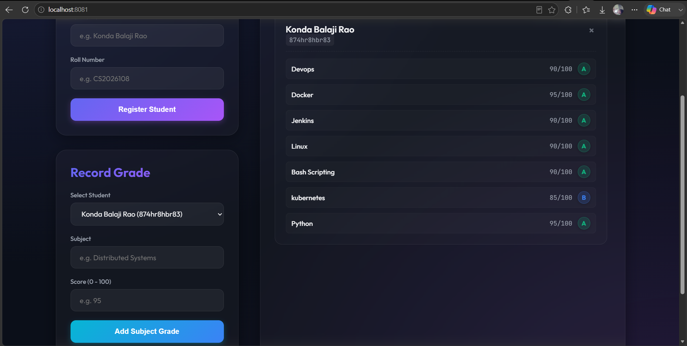

# 🎓 Student Grade Management API & Dashboard


A complete RESTful web service built with **Spring Boot 3.2.0** and **Java 17**, paired with a **premium frontend dashboard**. 

This project implements **Task 3 of the CodeAlpha DevOps Internship**. It features automated Java builds, continuous integration via GitHub Actions, and an integrated, highly-responsive web client.

---

## ✨ Features & Technical Stack
### Backend
* **Language:** Java 17
* **Framework:** Spring Boot 3.2.0
* **Build System:** Gradle 8.5
* **Database:** H2 In-Memory Database (automatic schema creation)
* **Testing:** JUnit 5 & MockMvc
* **CI/CD:** GitHub Actions (runs tests, builds artifact, uploads build jar)

### Frontend Dashboard
* **Design:** Built-in premium Glassmorphism Web Dashboard with smooth UI micro-animations and gradients.
* **Typography:** Utilizes Google Fonts (`Outfit` and `JetBrains Mono`).
* **Interactivity:** Real-time form submissions using vanilla JavaScript and fetch API. Live toasts for success and error handling.
* **Smart Calculations:** Automatic score-to-letter grade conversions mapped natively.

---

## 🚀 Getting Started

### Prerequisites
* **Java 17 JDK** (Make sure your `JAVA_HOME` environment variable points to JDK 17)

### Build and Run Locally
1. **Verify Gradle Configuration:**
   ```powershell
   .\gradlew.bat clean build
   ```
2. **Run Tests:**
   ```powershell
   .\gradlew.bat test
   ```
3. **Start the Application:**
   ```powershell
   .\gradlew.bat bootRun
   ```

---

## 🖥️ Live Client Web Interface
The application features a modern, fully-responsive dashboard running locally at:
👉 **[http://localhost:8081/](http://localhost:8081/)**

### Dashboard Highlights:
* **Interactive Forms:** Register students and record subject grades in real-time.
* **Student Roster Cards:** Clean glassmorphism cards that dynamically list enrolled students, subject-wise scores, and corresponding grades, complete with live action-buttons to delete students.
* **Server Health Indicator:** Real-time pulse indicator showing API online status.

---

## 📡 API Endpoints Reference

### 🧑‍🎓 Students
| Method | Endpoint | Description |
|---|---|---|
| `POST` | `/api/students` | Create a new student (JSON payload with `name`, `rollNumber`) |
| `GET` | `/api/students` | Retrieve all registered students |
| `GET` | `/api/students/{id}` | Retrieve a specific student by ID |
| `DELETE` | `/api/students/{id}` | Delete a student and all associated grades |

### 📝 Grades
| Method | Endpoint | Description |
|---|---|---|
| `POST` | `/api/students/{id}/grades` | Record a grade for a student (JSON payload with `subject`, `score`) |
| `GET` | `/api/students/{id}/grades` | Get all grades for a specific student |
| `PUT` | `/api/grades/{id}` | Update an existing grade |

---

## 🗄️ Database Console
The in-memory database records can be inspected in real-time at:
👉 **[http://localhost:8081/h2-console](http://localhost:8081/h2-console)**

* **JDBC URL:** `jdbc:h2:mem:gradedb`
* **Username:** `sa`
* **Password:** *(leave blank)*

---

## 📸 Output Screenshots

Here are the successful execution results of the Student Grade API project:



